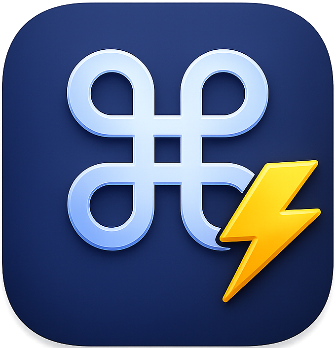

# QuickKey

<p align="center">
  
</p>

**Stop mousing around.**

A macOS menu bar app that surfaces keyboard shortcuts for whatever app you're currently using. Search, browse, favorite, and trigger shortcuts without leaving the keyboard.

<p align="center">
  
</p>

## Download

<p align="center">
  <a href="https://github.com/BrianB-22/QuickKey/releases/latest">
    ⬇️ Download QuickKey v1.2 (Latest Release)
  </a>
</p>

> **macOS security notice:** QuickKey is not signed with an Apple Developer certificate, so macOS will block it on first launch with a Gatekeeper warning. This is normal for indie apps distributed outside the App Store.
> See the [install instructions](Builds/README.md) for the step-by-step workaround — it only takes a minute and you only need to do it once.

## Features

- **Menu bar utility** — lives in the menu bar with no Dock icon
- **Auto-detects active app** — opens to the right app's shortcuts automatically
- **Search** — filter by command name, key combo, or description; toggle **All Apps** to search across every app at once
- **Favorites** — pin shortcuts across any app, persisted between launches
- **Trigger shortcuts** — click a key combo to fire it in the target app (requires Accessibility permission)
- **Global hotkey** — ⌥Space opens/closes QuickKey from anywhere
- **Installed apps filter** — only shows tabs for apps actually on your Mac
- **Persistent settings** — launch at login, font size, global hotkey, and trigger behavior all saved across restarts

## Supported Apps

System, Finder, Safari, Chrome, Firefox, Brave, Arc, VS Code, Cursor, Terminal, iTerm2, Xcode, Slack, Figma, Notion, Obsidian, Photoshop, Lightroom Classic, Illustrator, Premiere Pro, Final Cut Pro, Excel, Discord, Zoom, Microsoft Teams, Microsoft Word, Microsoft PowerPoint, Keynote, Pages, Numbers, Spotify, Raycast, IntelliJ / WebStorm, Vim / Neovim, nano, GitHub Desktop, Things 3, Superhuman, Linear, Telegram

## Requirements

- macOS 13 Ventura or later
- Xcode 15+ to build from source
- Accessibility permission (for shortcut triggering only)

## Installation

### Option 1 — Pre-compiled (easiest)

Download the latest `.dmg` from the [Releases page](https://github.com/BrianB-22/QuickKey/releases/latest) — no Xcode required.

Because QuickKey is not signed with an Apple Developer certificate, macOS will show a Gatekeeper warning on first launch. See the [install instructions](Builds/README.md) for the one-time workaround to open it.

### Option 2 — Build from source

Clone the repo and open the Xcode project:

```bash
git clone https://github.com/BrianB-22/QuickKey.git
cd QuickKey
open QuickKey.xcodeproj
```

Build and run with ⌘R. QuickKey will appear as a keyboard icon in your menu bar.

## Usage

1. Click the keyboard icon in the menu bar to open the popover
2. The app tab for your current app is selected automatically
3. Use the search bar to filter shortcuts, or toggle **All Apps** to search across every app at once
4. Right-click any shortcut to trigger it, copy the key combo, or add it to Favorites
5. Open Settings (gear icon) to configure launch at login, font size, and trigger behavior

## Keyboard Controls

| Shortcut | Action |
|---|---|
| ⌥ Space | Open / close QuickKey from any app |
| ⌥ ⌘ F | Open QuickKey directly on the Favorites tab |
| ← → | Navigate between app tabs (when search bar is not focused) |
| ↑ ↓ | Move highlight through the shortcut list |
| ↩ Return | Trigger the highlighted shortcut (requires Allow Key Combo Clicks to be enabled in Settings) |

## Settings

| Setting | Default | Description |
|---|---|---|
| Launch at Login | Off | Start QuickKey automatically on login |
| Show Help for Installed Apps Only | On | Hides tabs for apps not on your Mac |
| Allow Key Combo Clicks to Activate | Off | Click a key combo badge to fire it in the active app |
| Font Size | Medium | Small / Medium / Large |

## Architecture

The app is built with SwiftUI + AppKit. Key files:

| File | Role |
|---|---|
| `AppDelegate.swift` | Owns the status item, popover, and app lifecycle |
| `ContentView.swift` | Root SwiftUI view (header, search, tabs, shortcut list) |
| `ShortcutsViewModel.swift` | Search/filter logic and active app state |
| `ShortcutsDatabase.swift` | Static shortcut data for all supported apps |
| `FavoritesStore.swift` | UserDefaults-backed favorites |
| `HotkeyManager.swift` | Global hotkey via Carbon `RegisterEventHotKey` |
| `KeyEventSender.swift` | CGEvent keyboard synthesis for shortcut triggering |

## Support

If you find QuickKey useful, a ⭐ on GitHub goes a long way! Have a suggestion, found a bug, or just want to share a shortcut tip? Drop a message in the [Discussions](https://github.com/BrianB-22/QuickKey/discussions) tab — always happy to hear from people using it.

## License

MIT

## Disclaimer

QuickKey is provided as-is, without warranties of any kind. The keyboard shortcuts listed are believed to be accurate at the time of writing, but app updates may change them at any time. No guarantee is made regarding the completeness or correctness of any shortcut data. Use at your own discretion.
